<p align="center">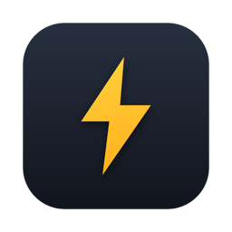</p>

# Bolt

A native macOS keyboard launcher. One hotkey, fuzzy search across apps, files, windows and commands, with clipboard history, window tiling, snippets and more built in. 100% Swift/SwiftUI, no Electron, no backend, idles in the tens of MB.

<p align="center">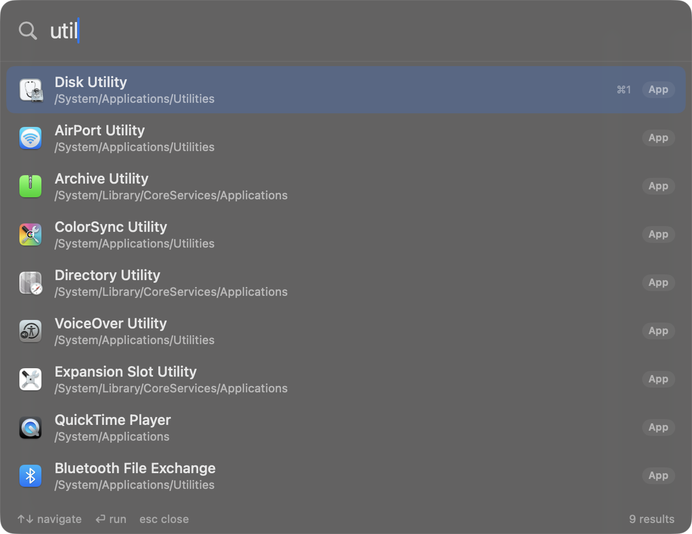</p>

[Features](#features) ·
[Download](#download) ·
[Build and install](#build-and-install) ·
[Permissions](#permissions-one-time) ·
[Hotkeys](#hotkeys) ·
[Search syntax](#search-syntax) ·
[Snippets](#snippets) ·
[Quicklinks](#quicklinks) ·
[Aliases](#aliases) ·
[Config](#config) ·
[Privacy](#privacy-notes) ·
[Architecture](#architecture) ·
[License](#license)

## Features

- **App launcher.** Fuzzy search with frecency ranking, the things you pick often float to the top. An empty query shows your most-used apps.
- **File search.** Backed by Spotlight (`mdfind`), so results are instant.
- **Window switcher.** Jump to any open window of any app.
- **Menu bar search.** `/query` lists the menu items of the app you were just in and triggers them.
- **Clipboard history.** Text and images, searchable, paste / copy / delete per entry. Entries marked concealed by password managers are skipped.
- **Snippets.** Insert from search, or live-expand `;keyword` anywhere you type, with `{date}`, `{time}` and `{clipboard}` placeholders.
- **Calculator.** Inline expressions and percentages, including the GST-style `18% on 25000`.
- **Unit and currency conversion.** `3 miles to km`, `72 f to c`, `100 usd to inr` (daily ECB rates, cached).
- **Color tools.** Hex / rgb / hsl conversions plus a screen eyedropper.
- **Emoji picker.** `:fire`, Enter pastes it.
- **Dictionary.** `define <word>` against the system dictionary.
- **Process killer.** `kill <name>`, sorted by CPU.
- **System commands.** Dark mode, empty trash, lock, sleep, restart, mute, quit and force-quit apps.
- **Window management.** Halves, quarters, maximize, center, next display, by hotkey or by name.
- **Quicklinks.** Keyword web searches (`g`, `gh`, `yt`, ...), fully customizable.
- **Browser bookmarks.** Chrome, Brave, Edge, Chromium, Vivaldi (and Safari with Full Disk Access) bookmarks in your results, opened in your default browser.
- **Scratchpad.** A pop-up note that persists between sessions.

| Calculator | Currency |
|---|---|
| 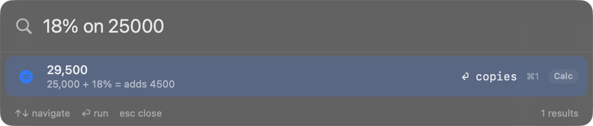 | 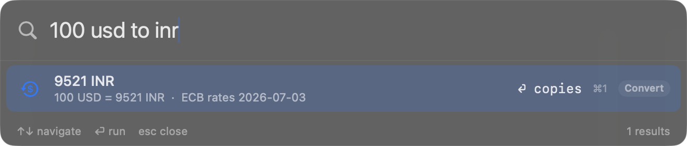 |

| Unit conversion | Color tools |
|---|---|
| 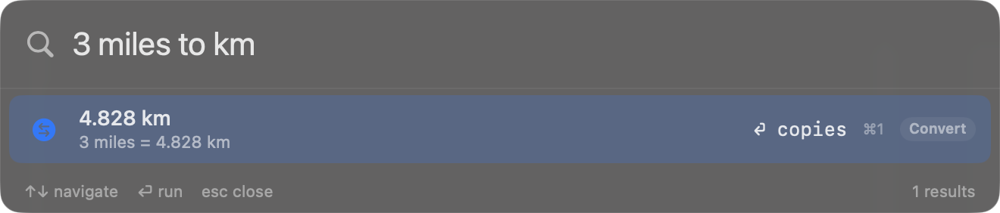 | 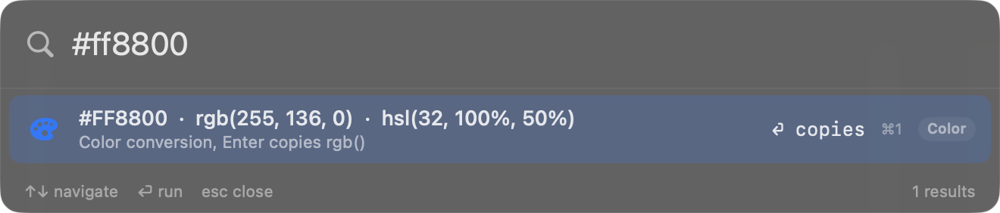 |

| Emoji | Dictionary |
|---|---|
| 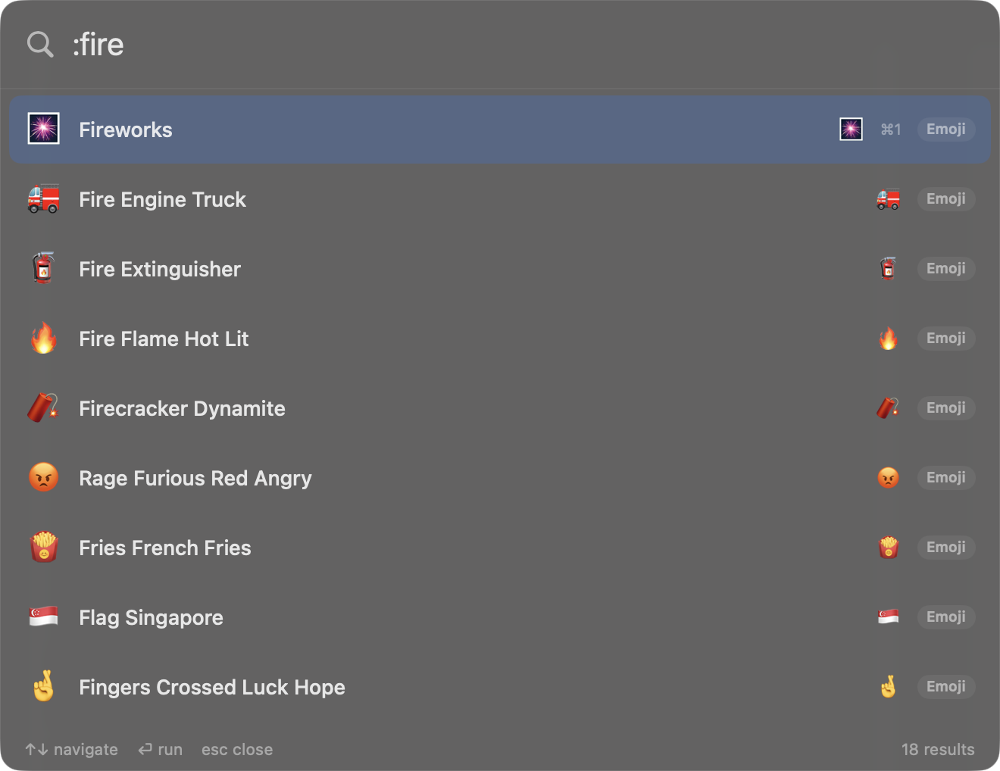 | 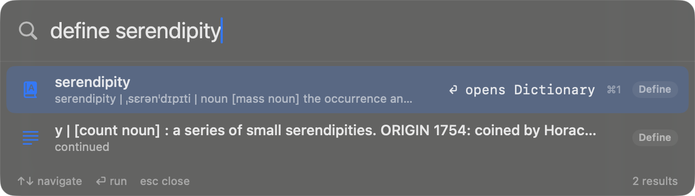 |

| Clipboard history | Menu bar search |
|---|---|
| 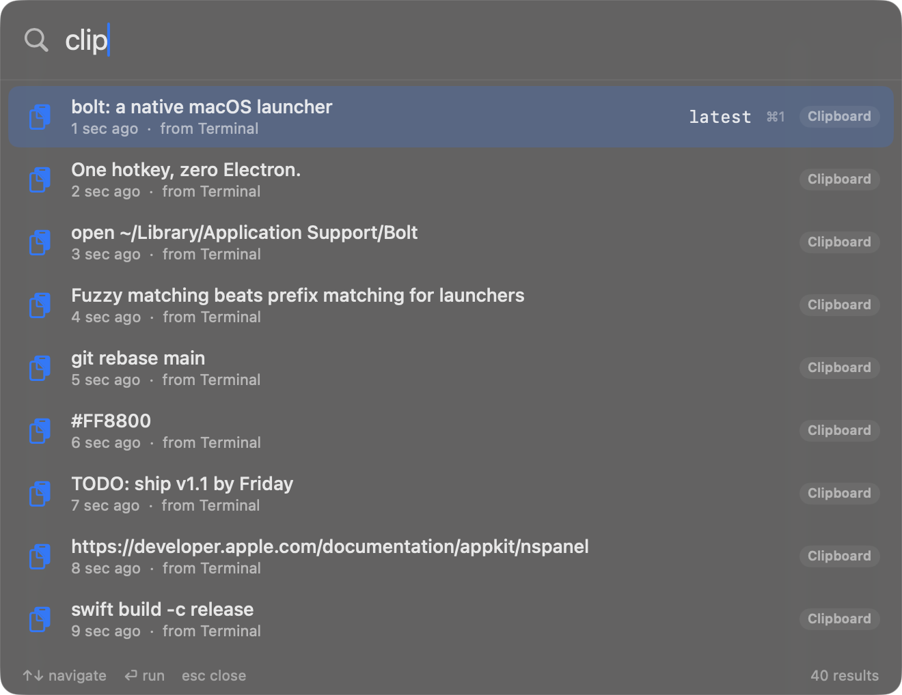 | 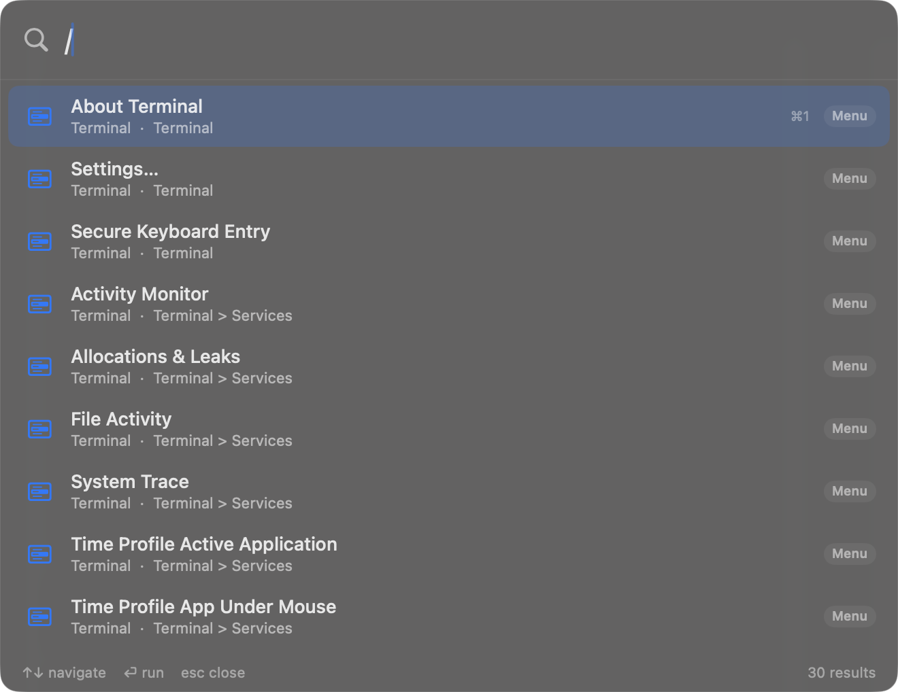 |

| Window switcher | Window management |
|---|---|
| 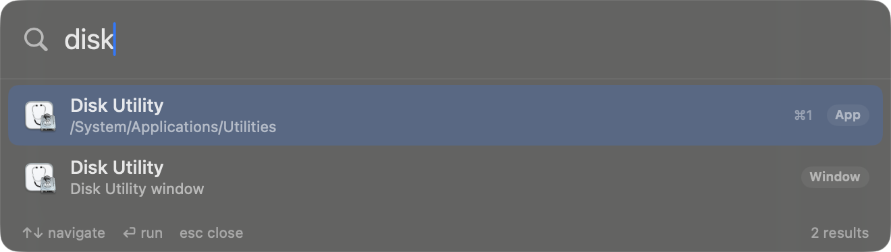 | 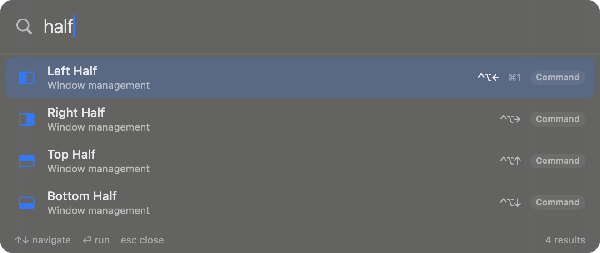 |

| Process killer | System commands |
|---|---|
| 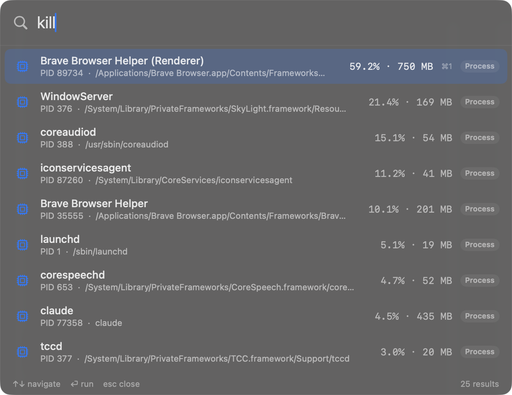 | 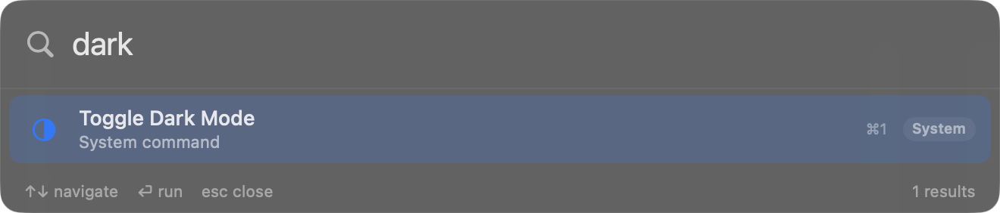 |

| Quicklinks | |
|---|---|
| 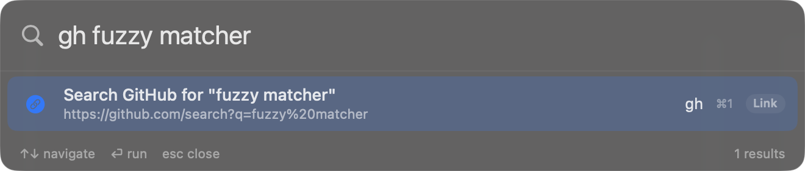 | |

## Download

Grab `Bolt-x.y.z.zip` from the [latest release](https://github.com/PranavV205/bolt-raycast-alt/releases/latest), unzip, and drag `Bolt.app` to `/Applications`.

First launch: macOS will warn that the app is from an unidentified developer (it is open source and self-signed, not notarized). Right-click `Bolt.app` > Open > Open, or approve it under System Settings > Privacy & Security. This is a one-time step, as is granting Accessibility for the window features (see [Permissions](#permissions-one-time)).

Prefer building from source? Read on.

## Build and install

```bash
./build-app.sh            # builds dist/Bolt.app
./build-app.sh --install  # also copies to /Applications and launches
```

Requires Xcode command line tools (Swift 5.9+). For development, `swift build && swift run` works too, but permissions are tied to the app bundle, so day-to-day use should be the installed .app.

If you rebuild often: macOS ties permission grants to the code signature, and the default ad-hoc signature changes every build, so grants like Accessibility die on each reinstall. Create a self-signed code-signing certificate named "Bolt Dev" (Keychain Access > Certificate Assistant > Create a Certificate, type: Code Signing) and `build-app.sh` will use it automatically, keeping your grants across rebuilds. `CODESIGN_IDENTITY=<name>` overrides the identity.

## Permissions (one-time)

Bolt asks for these on first run, all in System Settings > Privacy & Security:

- Accessibility: required for window tiling, menu bar search, window switching, auto-paste and snippet expansion. The Option+Space hotkey and app/file search work without it.
- Automation > System Events / Finder: prompted the first time you run a system command that uses AppleScript (Toggle Dark Mode, Empty Trash, Restart).

If something silently does nothing, check Accessibility first. After reinstalling to a different path, re-grant it.

## Hotkeys

All defaults below are rebindable, see [Rebinding](#rebinding). "Settings" is the `~/.bolt` folder: open it via the menu bar icon > Open Config Folder, or the "Open Config" command in the launcher.

| Hotkey | Action |
|---|---|
| Option+Space | Toggle the launcher |
| Ctrl+Option+V | Clipboard history |
| Ctrl+Option+S | Scratchpad |
| Ctrl+Option+Arrow | Tile window to half (left/right/top/bottom) |
| Ctrl+Option+U / I / J / K | Tile window to quarter |
| Ctrl+Option+Return | Maximize window |
| Ctrl+Option+C | Center window |
| Ctrl+Option+N | Move window to next display |

Inside the launcher: type to search, arrows or Ctrl+N/P to move, Enter to run, Cmd+1..9 to run the nth result, Esc to close. Destructive commands (Restart, Shut Down, Empty Trash, Force Quit) ask for Enter twice.

### Rebinding

Every global hotkey is rebindable. Add a `hotkeys` block to `~/.bolt/config.json` (the default file already contains one), then run "Reload Bolt Config" from the launcher, no restart needed:

```json
"hotkeys": {
  "toggleLauncher": "cmd+space",
  "clipboardHistory": "cmd+shift+v",
  "scratchpad": "none"
}
```

Binding names: `toggleLauncher`, `clipboardHistory`, `scratchpad`, `tileLeft`, `tileRight`, `tileTop`, `tileBottom`, `tileTopLeft`, `tileTopRight`, `tileBottomLeft`, `tileBottomRight`, `maximize`, `almostMaximize` (unbound by default), `center`, `nextDisplay`.

Combos are `modifier+modifier+key`. Modifiers: `cmd`, `ctrl`, `option` (or `alt`), `shift`. Keys: letters, digits, `space`, `return`, `tab`, `escape`, `delete`, arrow names (`left`, `right`, `up`, `down`), `home`, `end`, `pageup`, `pagedown`, `f1`-`f12`, and punctuation (`comma`, `period`, `slash`, `semicolon`, `quote`, `backslash`, `minus`, `equal`, `grave`). `"none"` disables a binding. At least one modifier is required except for F-keys. Invalid combos fall back to the default and show a warning toast, so a typo never locks you out of the launcher.

## Search syntax

| Type | Get |
|---|---|
| `vsco` | Apps, open windows, files, commands, all fuzzy ranked |
| `1920*0.18` | Inline calculator, Enter copies |
| `18% of 25000` or `18% on 25000` | Percentage (the `on` form adds it, GST style) |
| `3 miles to km`, `16 gb in mb`, `72 f to c` | Unit conversion |
| `100 usd to inr` | Currency (daily ECB rates, cached 24h) |
| `#ff8800` | Color conversions (hex / rgb / hsl) |
| `clip` or `clip <text>` | Clipboard history. Enter pastes, Cmd+Enter copies, Ctrl+Enter deletes |
| `kill <name>` | Processes by CPU. Enter SIGTERM, Cmd+Enter SIGKILL |
| `kill 3000` | What's listening on that TCP port, with its command line |
| `servers` | All dev servers: ports, project folder, command. Enter kills |
| `define <word>` | System dictionary |
| `:fire` or `emoji rocket` | Emoji, Enter pastes |
| `/save` | Menu items of the app you were in, Enter triggers |
| `g <query>`, `gh`, `yt`, `npm`, `wiki`, ... | Quicklinks (web searches) |
| `quit safari`, `force quit chrome` | Quit running apps |
| `lock`, `sleep`, `dark mode`, `empty trash`, `mute` | System commands |
| `left half`, `maximize`, `center` | Window tiling by name |
| `snippet` name or `;keyword` | Snippets, Enter pastes |
| `pick color` | Screen eyedropper, copies hex |
| `note` | Scratchpad |

Results are ranked by fuzzy match score plus frecency (things you pick often float up). On an empty query you get your most-used apps.

## Snippets

Search insertion works out of the box. Live expansion (type `;sig` anywhere and it becomes the snippet) needs Accessibility and is on by default; toggle `snippetExpansionEnabled` in config.

Edit `~/.bolt/snippets.json`:

```json
[
  { "keyword": ";sig", "name": "Email signature", "content": "Best,\nYour Name" }
]
```

Placeholders: `{date}`, `{time}`, `{clipboard}`, `{cursor}`. The `{cursor}` marker sets where the caret lands after the snippet is inserted (needs Accessibility, like auto-paste). Run "Reload Bolt Config" from the launcher after editing.

## Quicklinks

Edit `~/.bolt/quicklinks.json`. `{query}` is replaced with whatever you type after the keyword, URL-encoded. `base` opens when there is no argument.

```json
[
  { "keyword": "gh", "name": "GitHub", "template": "https://github.com/search?q={query}", "base": "https://github.com" }
]
```

## Aliases

`~/.bolt/aliases.json` maps a keyword to the query it stands for. Typing the keyword searches as if you typed the expansion, so an alias can point at any app, command, snippet or quicklink. Words after the alias are appended, which makes quicklink shortcuts work: with the alias below, `gs swift fuzzy` searches GitHub for "swift fuzzy".

```json
{
  "dm": "dark mode",
  "gs": "gh"
}
```

Run "Reload Bolt Config" after editing.

## Config

`~/.bolt/config.json`:

| Key | Default | Meaning |
|---|---|---|
| `clipboardHistoryEnabled` | true | Watch the pasteboard |
| `clipboardCapacity` | 50 | FIFO cap, oldest evicted |
| `snippetExpansionEnabled` | true | Live `;keyword` expansion |
| `fileSearchEnabled` | true | mdfind file results |
| `currencyEnabled` | true | Daily currency rates fetch |
| `updateCheckEnabled` | true | Daily new-release check against the GitHub API |
| `bookmarksEnabled` | true | Browser bookmarks in search results |
| `maxResults` | 40 | Result list cap |
| `hotkeys` | see [Rebinding](#rebinding) | Global hotkey bindings |

Runtime data (clipboard history, frecency, rates cache, scratchpad) lives in `~/Library/Application Support/Bolt/`.

## Privacy notes

- Clipboard history persists to disk unencrypted. Entries marked transient/concealed by password managers are skipped automatically. `clip` then Ctrl+Enter deletes a single entry.
- Bolt makes exactly two kinds of network request, each at most once a day: currency rates (api.frankfurter.app) and an update check (api.github.com). Both send nothing but the request itself, and both can be turned off (`currencyEnabled`, `updateCheckEnabled`) for a fully offline build.

## Architecture

SPM executable, packaged into an .app by `build-app.sh`. Carbon `RegisterEventHotKey` for hotkeys (no keystroke observation), non-activating borderless `NSPanel` + SwiftUI for the UI (the app you were in never loses focus), Accessibility API for window tiling / menu search / window switching, `mdfind` for files, a hand-written recursive-descent parser for the calculator, and JSON files for all state. No third-party dependencies.

## Your data stays yours

All personal customization (snippets, quicklinks, config) lives in `~/.bolt/` and all runtime state in `~/Library/Application Support/Bolt/`, both outside the repo. Pulling updates or rebuilding never touches them, and nothing you configure can end up in a commit.

## License

MIT, see [LICENSE](LICENSE).
